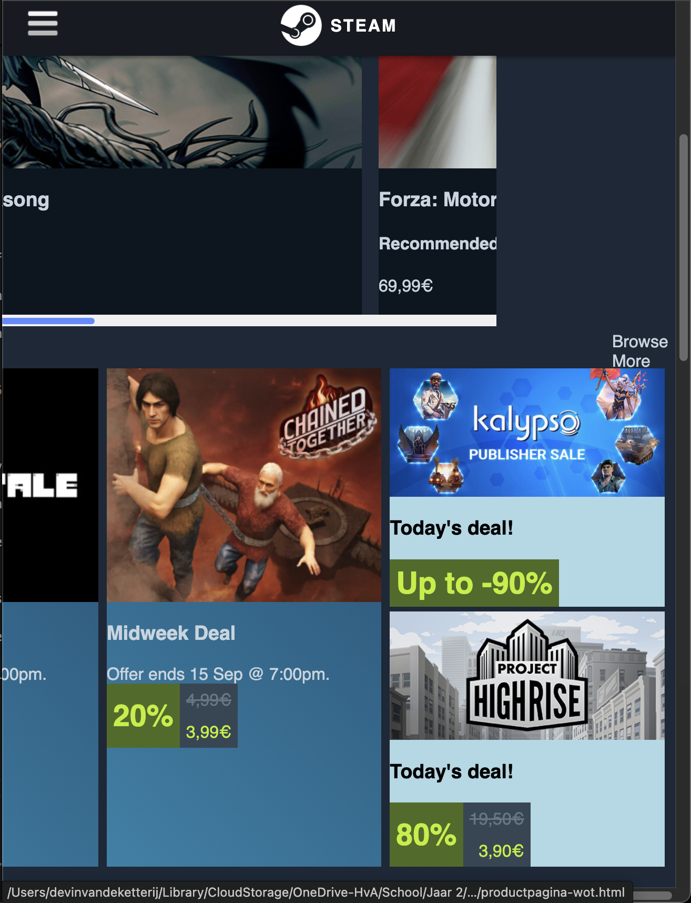
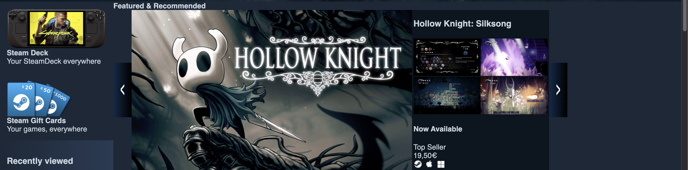

# Procesverslag
Markdown is een simpele manier om HTML te schrijven.  
Markdown cheat cheet: [Hulp bij het schrijven van Markdown](https://github.com/adam-p/markdown-here/wiki/Markdown-Cheatsheet).

Nb. De standaardstructuur en de spartaanse opmaak van de README.md zijn helemaal prima. Het gaat om de inhoud van je procesverslag. Besteedt de tijd voor pracht en praal aan je website.

Nb. Door *open* toe te voegen aan een *details* element kun je deze standaard open zetten. Fijn om dat steeds voor de relevante stuk(ken) te doen.

## Jij

  
uitwerken voor kick-off werkgroep

  ### Auteur:
Devin van de Ketterij

  #### Je startniveau:
Blauw

  #### Je focus:
Responsive
 

## Je website

  
uitwerken voor kick-off werkgroep

  ### Je opdracht:
https://store.steampowered.com/

  #### Screenshot(s) van de eerste pagina (small screen): 
  "Welcome to Steam"
  

  #### Screenshot(s) van de tweede pagina (small screen):
  "EA Sports FC 25 on Steam"
  
 

## Toegankelijkheidstest 1/2 (week 1)

  
uitwerken na test in 2e werkgroep

  ### Bevindingen
  Lijst met je bevindingen die in de test naar voren kwamen:
Ik heb mijn beeldscherm op zwart gezet (helderheid 0%) en zo een game proberen te sellecteren.
Hij verteld me dat ik in een navigatie window zit.
Als ik op tab druk, gaat hij naar de volgende knop. Hij verteld dat ik op een link bevind naar de store. Daarna verteld hij nog andere knoppen die daarnaast zijn. Ik klik enter en ga naar de store pagina. Daar gaat hij alle onrelevante knoppen af en als ik meerdere keren op tab druk ga ik daar sneller doorheen.
Hierna kom ik mijn eerste game tegen. Hij zegt de naam van de game en daarna een CTA, "Visit now".
Ik druk weer op tab en ga naar de volgende game. Daar zegt hij dat het een top seller is en dat de game 70 euro kost.
Als ik op tab blijf drukken dan gaat hij langs alle games, op een manier die ik best fijn vind.
Ik klik op een game. Hier gaat hij eerst alle menu items af, waarna hij vervolgens naar de informatie van de game gaat. Daarna volgt hij diverse knoppen zoals zet op wishlist of zet in winkelwagen.

## Breakdownschets (week 1)

  
uitwerken na afloop 3e werkgroep

  ### de hele pagina: 
  

  ### dynamisch deel (bijv menu): 
  

  ### wellicht nog een dynamisch deel (bijv filter): 
  

## Voortgang 1 (week 2)

  
uitwerken voor 1e voortgang

  ### Stand van zaken
  hier dit ging goed & dit was lastig (neem ook screenshots op van delen van je website en code)
Het toevoegen van een video die autoplayed en looped vond ik lastig, hier heb ik veel mee moeten spelen.
Het HTML schrijven hoefde ik niet heel veel bij na te denken verder. Het was best makkelijk, maar wel heel veel. Ik moest heel veel afbeeldingen en video's downloaden en ze op een logische manier noemen en in folders plaatsen. Wanneer je begint hiermee is t wel even moeilijk, maar als je de juiste folders hebt gemaakt is t best makkelijk verder.
Ik heb ook beetje gespeeld met javascript alvast. Dit was wel heel lastig, omdat ik er nog niet veel van snap. Het gaat tot nu toe vooral nog fout bij de querySelector. Mij lukt het nog niet om elk element op mijn pagina te sellecteren die ik wil.

  ### Agenda voor meeting
  samen met je groepje opstellen

  | student 1      | student 2          | student 3    | student 4        |
  | ---            | ---                | ---          | ---              |
  | dit bespreken  | en dit             | en ik dit    | en dan ik dat    |
  | en dat ook nog | dit als er tijd is | nog een punt | dit wil ik zeker |
  | ...            | ...                | ...          | ...              |

  ### Verslag van meeting
  hier na afloop snel de uitkomsten van de meeting vastleggen

  - punt 1
  - punt 2
  - nog een punt
  - ...

## Voortgang 2 (week 3)

  
uitwerken voor 2e voortgang

  ### Stand van zaken
  hier dit ging goed & dit was lastig (neem ook screenshots op van delen van je website en code)
Ik heb de hele week een header volledig responsive proberen te maken. Dit is gelukt. Het was een hoop spelen en testen en nam de hele week in beslag. Op vrijdag kon ik eindelijk aan de css van de rest van mijn website. Voor het feedback moment heb ik een responsive grid weten te maken voor de section "Discount en Events". De nav heb ik alleen maar met flexbox gedaan, dus wil ik ook laten zien dat ik met grid kan werken.
Op moment van schrijven heb ik geen vertrouwen dat ik beide pagina's af krijg, omdat het zoveel werk kost. Ik heb nog een week, waarin ik eigenlijk elke dag de hele dag moet gaan besteden aan beide pagina's. Ik verwacht niet dat ik het af ga krijgen en vind het helaas een onrealistisch doel om twee pagina's in 4 weken af te krijgen terwijl je nog van alles moet leren over grid.

Ik heb nu 3 css bestanden. op moment van schrijven heb ik precies 800 regels css geschreven, als je lege regels mee telt.

  ### Agenda voor meeting
  samen met je groepje opstellen

  | student 1      | student 2          | student 3    | student 4        |
  | ---            | ---                | ---          | ---              |
  | dit bespreken  | en dit             | en ik dit    | en dan ik dat    |
  | en dat ook nog | dit als er tijd is | nog een punt | dit wil ik zeker |
  | ...            | ...                | ...          | ...              |

  ### Verslag van meeting
  hier na afloop snel de uitkomsten van de meeting vastleggen

  - punt 1
  - punt 2
  - nog een punt
- ...

## Toegankelijkheidstest 2/2 (week 4)

  
uitwerken na test in 9e werkgroep

  ### Bevindingen
  Lijst met je bevindingen die in de test naar voren kwamen (geef ook aan wat er verbeterd is):

  Ik heb mijn HTML verbeterd naar aanleiding van de test. De test verliep goed, alleen miste ik op sommige plekken, zoals afbeeldingen, nog een alt. Ook heb ik sommige alts aangepast.

## Voortgang 3 (week 4)

  
uitwerken voor 3e voortgang

  ### Stand van zaken
  hier dit ging goed & dit was lastig (neem ook screenshots op van delen van je website en code)

  ### Agenda voor meeting
  samen met je groepje opstellen

  | student 1      | student 2          | student 3    | student 4        |
  | ---            | ---                | ---          | ---              |
  | dit bespreken  | en dit             | en ik dit    | en dan ik dat    |
  | en dat ook nog | dit als er tijd is | nog een punt | dit wil ik zeker |
  | ...            | ...                | ...          | ...              |

  ### Verslag van meeting
  hier na afloop snel de uitkomsten van de meeting vastleggen

  - punt 1
  - punt 2
  - nog een punt
  - ...

## Eindgesprek (week 5)

  
uitwerken voor eindgesprek

  ### Je uitkomst - karakteristiek screenshots:
  

  ### Dit ging goed/Heb ik geleerd: 
  Korte omschrijving met plaatjes

  Ik heb geleerd wanneer je flexbox en grid gebruikt. Flexbox gebruik je sneller bij kleine handelingen en grid sneller bij grote.
  Ik heb meer geleerd over css, hoe je bijvoorbeeld nth:type moet gebruiken en hoe je precies de element sellecteerd die ik zoek.
  Met alle ervaring die ik heb van het maken van mijn homepagina, ging het maken van de productpagina makkelijker en veel sneller.

  

  ### Dit was lastig/Is niet gelukt:
De opdrachten op DLO uitvoeren vind ik lastig. Als je voor het eerst geintroduseerd wordt aan een onderwerp zoals grid box is het niet fijn om meteen te moeten coderen, zonder dat je weet welke regels je moet gebruiken. Vooral uitzoeken welke regels er van toepassing zijn, was lastig. De carousel opdracht was daardoor ook niet gelukt.

Ook vind ik javascript nogsteeds lastig. Ik heb daar veel hulp bij moeten krijgen. Als ik nu terug kijk op mijn javascript, vind ik het ook lastig om het aan te passen, zodat het wat anders zou kunnen doen.

het was niet gelukt om alles wat te breed is voor het scherm, scrollbaar te maken.

  

Ook was het niet gelukt om de buttons op dezelfde manier responsive te maken als op de steam website

  

## Bronnenlijst

  
continu bijhouden terwijl je werkt

  Nb. Wees specifiek ('css-tricks' als bron is bijv. niet specifiek genoeg). 
  Nb. ChatGpT en andere AI horen er ook bij.
  Nb. Vermeld de bronnen ook in je code.

  1. CSS Remedy: https://github.com/jensimmons/cssremedy/blob/master/css/remedy.css
  2. Learn CSS the easy way: https://youtu.be/eHaZlFcGl6k?si=yZSN-ElLAmLZVsJ0
  3. Zelfgemaakte code uit de Flexbox oefening: https://codepen.io/Devinket/pen/emJpJZr
  4. Zelfgemaakte code uit hamburger menu oefening: https://codepen.io/Devinket/pen/MYKKjmO
  5. Steam: https://store.steampowered.com/ (voor diverse waarden en afbeeldingen)
  6. ChatGPT: ChatGPT heb ik enkele keren benaderd wanneer ik er niet meer uit kwam. Op zo'n moment legde ik de situatie uit aan ChatGPT. Dan kwam daar een code uit (vaak met classes). Ik ben door de code heen gaan kijken welke regels er anders dan mijn code was, en welke regels code ik kan gebruiken voor mijn code. Hieronder geef ik aan welke prompts ik heb gebruikt:
  - Javascript Featured and recommended: https://chatgpt.com/share/68da487a-5c4c-8005-9ab8-0f1ac99864c7

Vragen die ik gesteld heb:
  - Main centreren: https://chatgpt.com/share/68da4989-058c-8005-9086-1fe2ab20c9c7
  - Items centreren in flexbox: https://chatgpt.com/share/68da48da-3cec-8005-9569-388157b74943
  - Alle childs sellecteren: https://chatgpt.com/share/68da49a9-32e4-8005-90c0-62ec773b737f
  - Childs uitsluiten: https://chatgpt.com/share/68da49bc-61c0-8005-9c89-5105768019de

